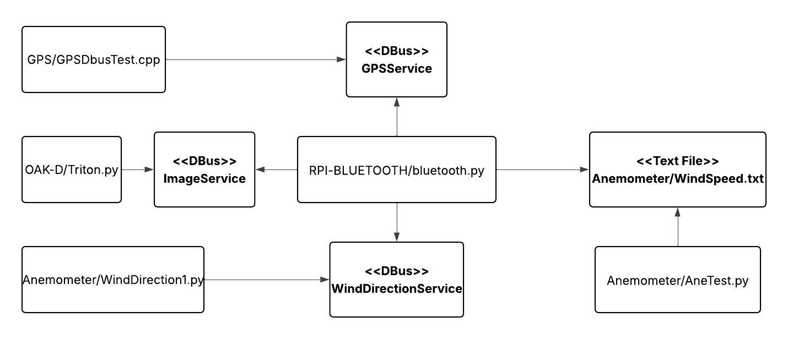

**DEPENDENCIES**
- dbus-python 1.3.2
- gobject 0.1.0
- pillow 11.10
- datetime 5.5
- Python 3.11
- ../OAK-D/Triton.py
- ../GPS/gps_dbus_test
- ../Anemometer/AneTest.py and ../Anemometer/WindDirection1.py

**DEVICE REQUIREMENTS**
- Raspberry Pi 3B with Raspberry Pi OS Debian Bookworm 64-Bit
- To Run Dependencies:
    - Oak-D Camera
    - Adafruit Flora GPS Module
    - Anemometer (Wind Direction and Speed)
    - 16-Bit ADC
    
**OVERVIEW OF EACH SOFTWARE MODULE**
bluetooth.py - This file enables Bluetooth Low Energy communication with the iOS device (see the ../Triton folder). It registers the GATT server, advertisements, services, and characteristics. This file also collects information from the OAK-D camera via dbus, the GPS module via dbus, the Wind Direction module via dbus, and the Wind Speed module via a file.
