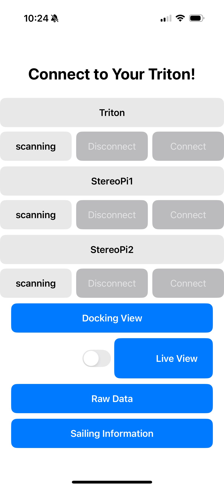
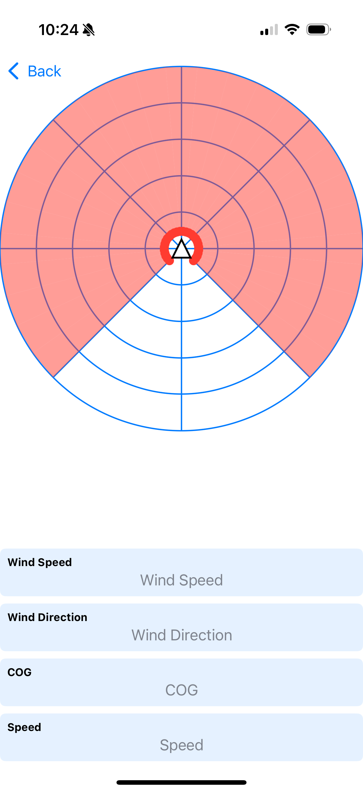
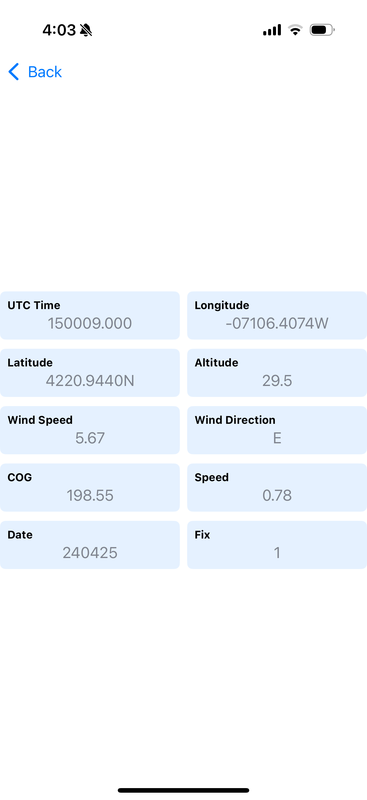

**DEPENDENCIES**
- CoreBluetooth
- SwiftUI
- XCode 16.3 or Higher

**DEVICE REQUIREMENTS**
- For Development: A Mac with XCode 16.3 or Higher
- For Running the App: An iPhone with iOS 18 or Higher

**DEVICES USED**
- For Development: MacBook Pro, 16-inch, 2019, macOS Sequoia 15.3.2
- For Testing: 
    - iPhone 11 Pro, iOS 18.1.1
    - iPhone 16 Pro, iOS 18.3.2
    
**OVERVIEW OF EACH SOFTWARE MODULE**\
*All_camera_10_points.swift* - This is the code that converts the depth and object recognition data provided by the OAK-D and StereoPi cameras. The cameras use a grid-like depth map and send the smallest distance for each column over Bluetooth. The rendering converts each distance value into a polar point on a map. As the depth values change, the polar points adjust their position accordingly. If the OAK-D detects a boat or person they will be represented as a colored triangle at their approximate location or on the edge of the map if they are farther than 15 meters away.\
*BluetoothService.swift* - This is the code that controls and manages the bluetooth connection between the iOS device and the Triton (main module) and StereoPis (peripheral modules). This includes connecting, disconnecting, discovering services, receiving and parsing data, and more.\
*ContentView.swift* - This is the top-level file that defines the application's UI and layout.\
*DataStructs.swift* - This file contains two of the data structs that we created to organize our data better: one for GPS data and one for Anemometer data. This allows us to have simpler data extraction for the UI once the data is parsed in BluetoothService.\
*ImageConversion.swift* - This file contains all of our functions related to converting the serial data of the OAK-D's live view to a viewable image within the application.\
*info_tabs.swift* - This is a section that delivers general information for how to safely approach and dock a ship as well as what the proper right of way rules are regarding open sailing.\
*Info.plist* - This is the information property list file, a file used by Apple that contains configuration information for the application. The most important use of this in our app is for Bluetooth permissions.\
*ServiceDefinitions.swift* - This file contains all of the Service Definitions for our app. It contains all of the UUIDs for the characteristics, services, and connection statuses.\
*TritonApp.swift* - This is the top level module that is our app. It instantiates ContentView to display our UI within Swift's app structure.\
